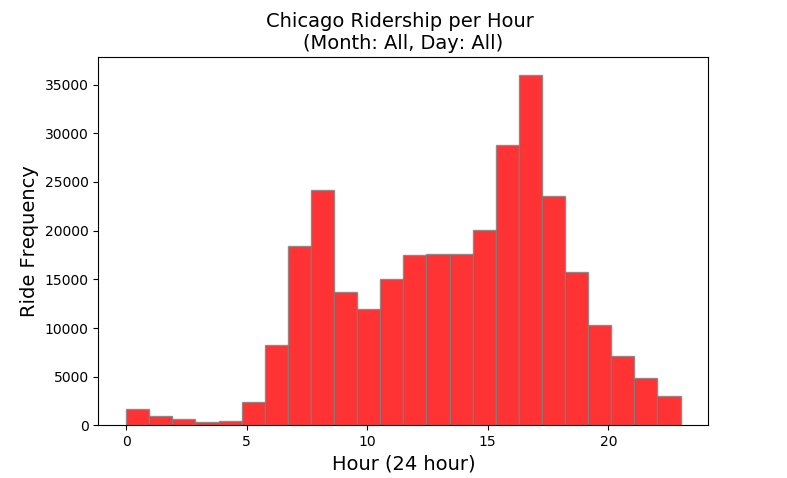

# Exploring USA Bikeshare Data

### Summary
One of my first projects when I was learning Python. The project provides a command line style python interface for a user to explore bikeshare data between three large cities: Chicago, New York City, and Washington, DC. The data was provided by Motivate, a bike share system provider for many major cities in the United States. 



## Getting Started

Cloning the git repository and installing the provided packages will help you get a copy of the project up and running on your local machine. The program was written with Python and the packages were managed using the Ananconda platform. 

```
git clone https://github.com/daniel-codes/airbnb-austin-tx.git
pip install -r /path/to/requirements.txt
```

To run the program:
`python bikeshare.py`

File Description:
* bikeshare.py - Interactive Python program (command line style)
* chicago.csv - Chicago, IL dataset
* new_york_city.csv - New York City, NY dataset
* washington.csv - Washington, DC dataset
* requirements.txt - packages used to perform this analysis

## Authors

- **Daniel Cummings** - [daniel-codes](https://github.com/daniel-codes)

## License

This project is licensed under the MIT License - see the [LICENSE.md](LICENSE.md) file for details

## Acknowledgments

This project was performed as part of the Data Analyst Nanodegree program at [Udacity](www.udacity.com)